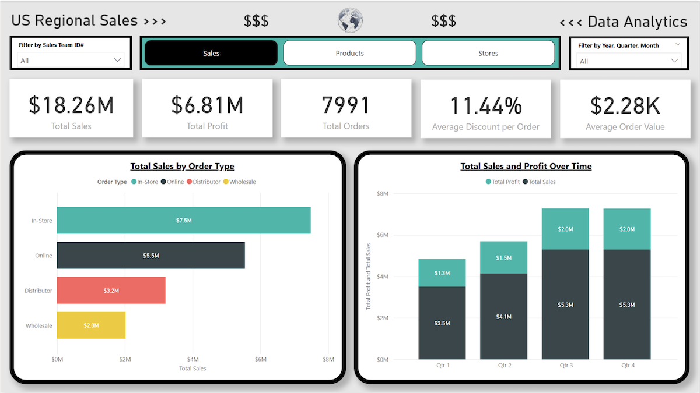
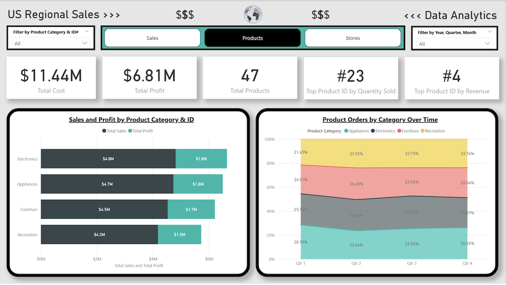
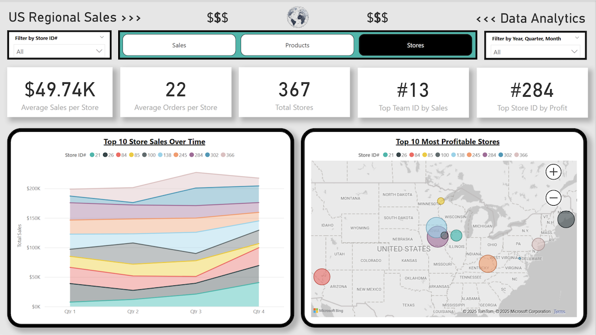

# regional-sales-analysis
SQL + Power BI sales analytics: cleaning, modeling, KPIs (revenue, AOV, category/region trends), interactive filters &amp; drilldowns. Includes README, well‑commented SQL, PBIX, and screenshots. Predicted vs. achieved targets documented. QuickStart Data Analytics bootcamp project.

# 📊 Sales Performance & Product Trend Analysis Dashboard  

## 🔹 Project Overview  
This project analyzes **U.S. Regional Sales data** to uncover actionable insights into sales performance, product trends, team contributions, and seasonal patterns. Using **MySQL** for structured data modeling and **Power BI** for interactive dashboards, the analysis highlights how businesses can leverage data for better decision-making around sales strategy, inventory, and market expansion.  

## 🔹 Dataset  
- **Source**: [U.S. Regional Sales Dataset – Kaggle](https://www.kaggle.com/datasets/talhabu/us-regional-sales-data/data)  
- **Size & Scope**: 47 products, 367 stores, multiple sales channels across several years  
- **Key Attributes**: Order date, sales channel, store, product, sales team, quantity, cost, price, discounts  

## 🔹 Tools & Skills Used  
- **SQL (MySQL)**: Data cleaning, schema design, star schema modeling, transformations  
- **Power BI**: Multi-page interactive dashboards, DAX calculations, visualization design  
- **Data Modeling**: Star schema, fact & dimension tables, relationships, primary/foreign keys  
- **Business Analysis**: Trend analysis, profitability evaluation, performance monitoring  

## 🔹 Methodology  
1. **Data Structuring in MySQL**  
   - Built a star schema with fact & dimension tables (sales, product, store, customer, sales team, date).  
   - Standardized non-uniform date formats and reformatted cost/price data types.  
   - Verified row counts and data integrity post-transformation.  

2. **Dashboard Development in Power BI**  
   - Created a **3-page interactive dashboard** focused on Sales, Products, and Stores.  
   - Developed DAX measures (e.g., Avg Sale Price, Total Profit, Top-Selling Products).  
   - Integrated external USPS ZIP code data for geographic mapping of store sales.  
   - Designed custom product categories to enrich visualization where dataset lacked detail.  

3. **Visualization Choices**  
   - 📊 Stacked bar/column charts for revenue & profit by category and over time.  
   - 🌎 Geographic bubble maps for store-level sales distribution.  
   - 📈 Stacked area charts to highlight product mix shifts and store performance trends.  

## 🔹 Key Insights  
- 🏬 **In-store sales** generated the highest orders and revenue compared to online, distributor, and wholesale channels.  
- 📆 **Quarters 3 & 4** consistently outperformed, revealing strong seasonal trends.  
- 💰 **2020 was the most profitable year** in the dataset.  
- ⚡ **Electronics** was the top-performing category; Product #23 sold the highest quantity, while Product #4 drove the most revenue.  
- 🏆 **Store #284** was the most profitable; **Sales Team #13** led in average earnings.  
- 📊 Average total sales per store: **~$49,740**.  

## 🔹 Business Impact  
This project demonstrates how businesses can:  
- Identify top-performing products and underperforming categories.  
- Optimize seasonal marketing and inventory strategies.  
- Evaluate store and team-level performance for incentive planning.  
- Explore opportunities for regional expansion based on store profitability.  

## 🔹 Deliverables  
- 📂 [Reports](reports/) – Written report & dashboard export (PDFs)  
- 🗄️ [SQL](sql/) – Schema design & transformations  
- 📊 [Power BI](powerbi/) – Interactive dashboard (.pbix)  
- 🖼️ [Assets](assets/) – Screenshots for quick preview  

---

## 🔹 Dashboard Screenshots  

### Sales View  
  

### Products View  
  

### Stores View  
  
